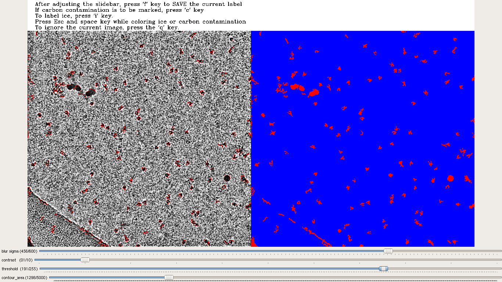

# CASSPER-Cryo EM hunt

This repo contains the files to run the **CASSPER** semantic segmentation suite. 

#### Labeling tool

 The mrc files to be labeled are to be put into a folder.
* The program can be run as `python label_generator.py -i mrc_directory -o output_directory`
* `mrc_directory` specifies the location of the folder containing all the mrc files
* `output_directory` specifies the location to which the labels are to be stored
* Adjust the `blur_sigma` and `contrast` trackbars untill the protein and ice particles are clearly visible.
* Now adjust the `threshold` and `contour_area` trackbars to get the labels of the desired protien particles only.
----

